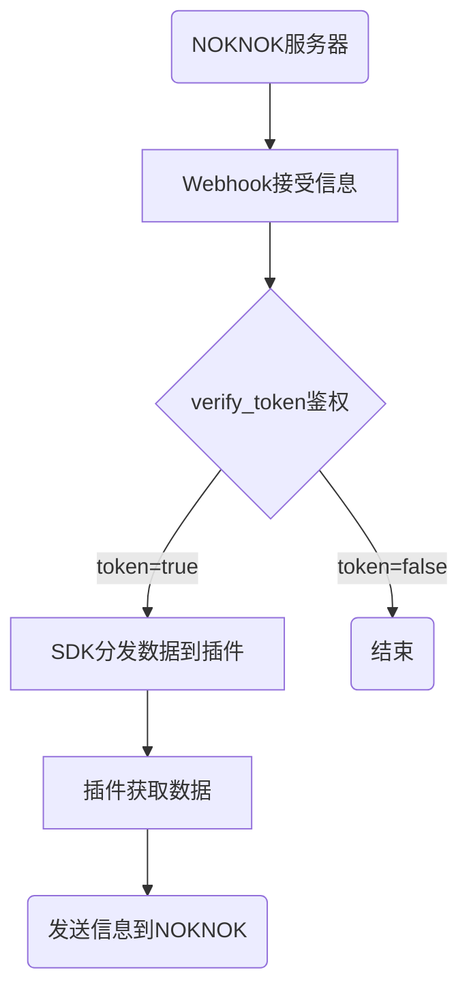

# 初步介绍

> 提示
> 
> 如果你阅读过程遇到问题，请在百度查招这些名词
## SDK介绍
SDKNAME是 **[NOKNOKBOT](https://www.noknok.cn/)** 的PHP机器人异步架构，它会对NOK机器人收到的消息进行区分和处理，此SDK以插件形式，分发数据内容，让开发者完成更多的操作。

SDKNAME是基于 **NOKNOKBOTAPI** 开发的，它的底层使用到的是PHP内置的 **Curl** 来完成请求的。

SDKNAME主要采用的是 **WebHook** 同时做到异步操作，当然这得益于PHP的 **ob_end_clean** 等方法，使得SDKNAME可以巧妙的处理大量请求。

## 请求流程

下面是简单的请求流程

上面是机器人收到信息，SDK处理分发，插件处理发送信息的过程。

## 特别功能

* 完整可视的接口
* 支持自定义类(即代表插件)来同时接受信息
* 自动区分消息类型，分别分发。

